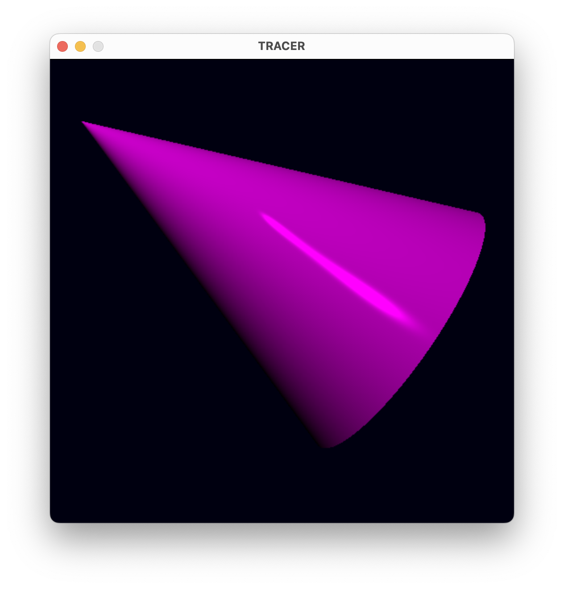
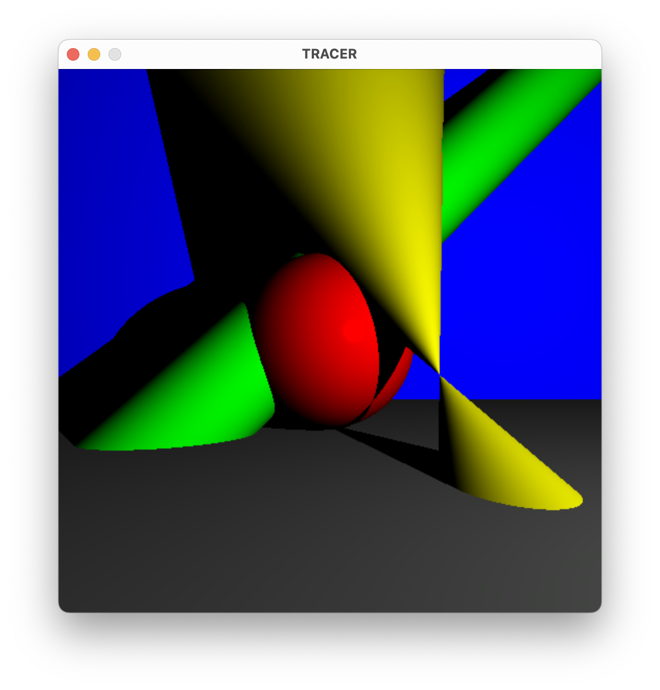
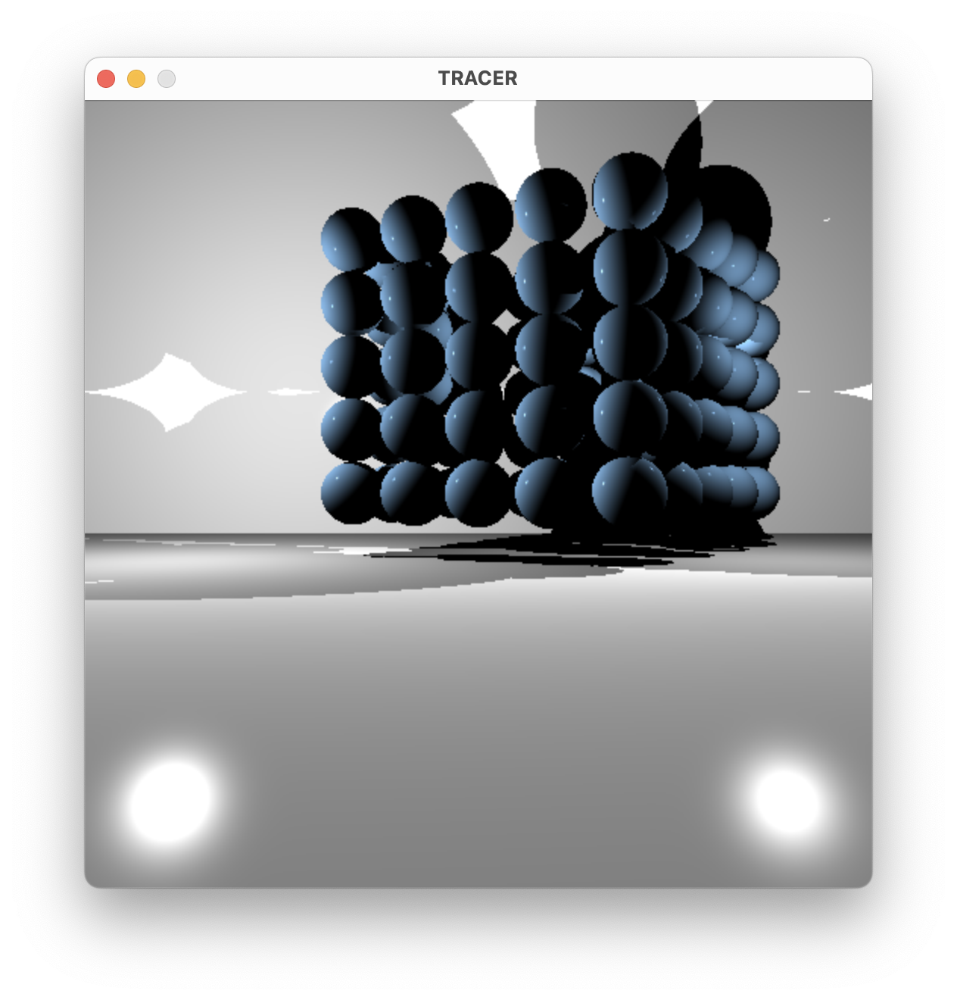
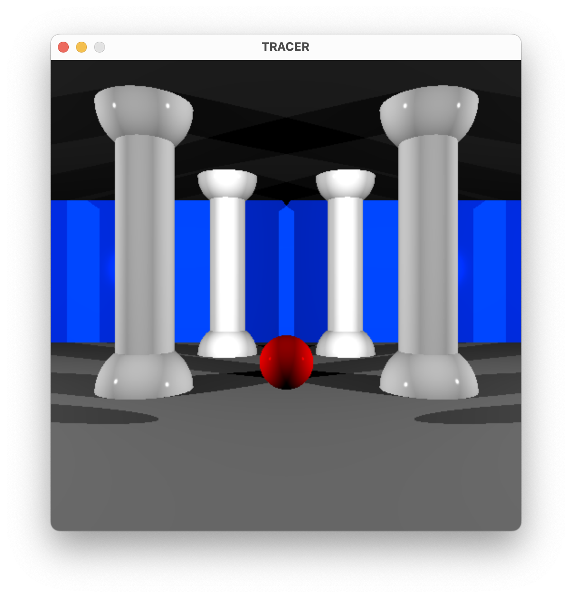

# 🌀 RTv1 – Mini Ray Tracer

A simple ray tracer written in C using the MinilibX graphics library.
This project demonstrates the basics of 3D rendering using ray tracing techniques.


## 🚀 Features

- 🔴 Sphere, Plane, Cone, and Cylinder rendering
- 💡 Basic lighting:
  - Ambient
  - Diffuse
  - Specular (Phong reflection)
- 🌚 Shadows
- 🎥 Camera movement
- 💨 Object rotation / translation
- 🛠️ Configurable scene via `.txt` files

## 🗂️ Project structure

``` bash
learn-tracer/
├── imgs/            # Screenshots
├── libft/           # Custom C library
├── minilibx/        # Graphics library
├── scenes/          # Test scenes
├── src/             # Sources
├── raytray.h        # Header file
├── Makefile         # Build system
└── README.md
```

## 🛠️ Installation & Usage

```bash
# Clone the repository
git https://github.com/vbrovenk/learn-tracer.git
cd learn-tracer

# Build the project
make

# Run with one of the .txt scenes files in the scenes/ folder or create your own
./RTv1 scenes/sphere.txt
```

## 🎮 Controls

| Action                 | Key                     |
|------------------------|-------------------------|
| Move Camera            | Arrow Keys              |
| Rotate Camera X        | W / S                   |
| Rotate Camera Y        | A / D                   |
| Exit                   | ESC                     |

## 📸 Examples of scenes

|  Cylinder                      | Scene2                       |
|--------------------------------|------------------------------|
|  |  |

|  Cube                          | Scene3                       |
|--------------------------------|------------------------------|
|      |  |

## 📝 Scene Format Example

```conf
# Camera settings
CAMERA
position: 0, 0, 0 # Camera is at the origin

CYLINDER
position: 0, 0, 5        # Base position of the cylinder
color: 255, 0, 255       # RGB color (magenta)
height1: 0               # Bottom cap height
height2: 4               # Top cap height
direction: -0.6, 0.4, 0  # Direction vector (orientation)
reflective: 0.3          # Reflectiveness (0 = none, 1 = fully reflective)

# Light source
LIGHT
position: 3, 8, -2  # Position of the light
intensity: 0.5      # Brightness of the light (range: 0.0–1.0)
```